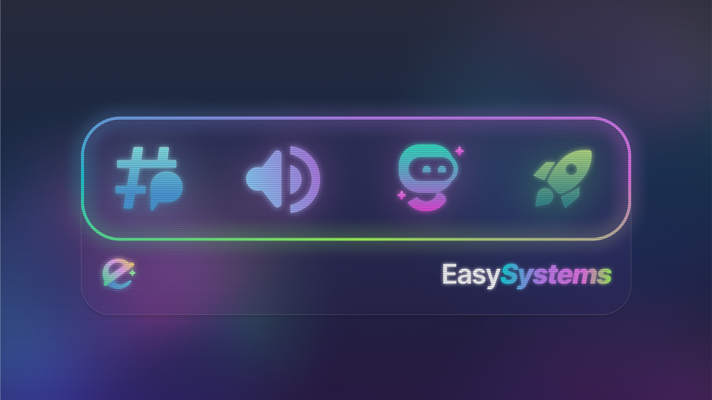

---

Hey **@everyone**,

I'm super excited to introduce you to the team behind the scenes of **EasyThreads** or better **[EasySystems](https://easystems.live)** the company behind EasyThreads. 
<!-- truncate -->
We are a small team of developers and designers who are passionate about creating the best experience for you. We are always working hard to bring you the best features and updates.

## Sr. Developement
_The Sr. Developement team consists of the lead developers and is responsible for the central development and management of the company._

_The tasks range from leading the company to maintaining the core software._
### SpaceDev
> Hey everyone,  
> I am SpaceDev and I come from Bavaria, Germany.   
Here at EasySystems I am the **CEO and Sr. Developer** and I have the aim to provide the best Apps possible on Discord!

#### What are your main tasks as a lead developer at our company?  

> As CEO and Sr. Developer my main tasks are besides the **Development of EasyThreads** also to keep and **maintain the infrastructure behind the bots**, for example the API > integrations and other software and systems.

#### Anything you want to tell the community?  

> I want to say a **big thanks to the entire community**. When I first started this project I was never expecting it for becoming this big, therefore a huge thanks for making all this possible! You motivate me the most to do what I do.

### Tim
We have not yet received a response from this staff member. This may change at a later date.
### Felixprogram
We have not yet received a response from this staff member. This may change at a later date.

## Developement
_They are responsible for the development and maintenance of the company's software._

_The tasks range from developing new features to fixing bugs._
### Tay
> Hey, i'm Tay, a German Non-Binary Developer.
> I do stuff on the Internet and like to Develop Websites, ChatBots and AI's.
> Here at EasySystems, i was one of the first **Developers in the Team**. 

> Currently i **develop EasyLevels**, and one of the **AI Providers for EasyYAUDAB**. Before i worked on EasyYAUDAB and EasyEvents (formerly known as Eventy).
> I always use the latest Discord.js as much as possible to have the newest and greatest Support for everything new.

> Other than Developing i like to cook, meet with Friends, do Human Resources stuff in a different project, or build furniture for me.

> So yeah, thats me. Cya around ;)

### Zee
> Hiya, I'm zee, or zippybonzo (use the terms interchangably).   
> I'm a node.js and python developer who writes the documentation here. I'm learning swift at the moment when I have spare time.   
> I **manage the documentation for EasyThreads** and keep it all up to date and running. I'm also a bit of a network nerd (I enjoy toying with UniFi equipment when I have time). 

> Beyond that, not a whole lot else I can say. :)

## Management
_They are responsible for the management of the company and the coordination of the team._

_The tasks range from managing the team to coordinating internal processes._
### Melon
> Hey there,  
> I'm melon _(he/him)_, located near Berlin (Germany 🇩🇪)  and **Developer & Manager** here at **EasySystems**. Also I'm passionate about creating the best experience for you and always working hard to bring you the best features and updates.  

#### What do you do at EasySystems?

> ~I'm interviewing myself right now..~  
Here at EasySystems I mainly code in JavaScript (or for the project in TypeScript). I'm also the Legal & Staff Manager here  and do all the little website things here.
>
#### I heardt you are a Gamer, which games do you play?
> I play a wide range of games, including simulators and first-person shooters. ✨  
Currently, I'm playing __Valorant__ and __Minecraft__ almost every day. Sometimes I hit the throttle in __WRC__ or play __football with cars__...

#### Anything you would say to the community?
> You can reach me over Discord (`the.melon`), on [GitHub](https://github.com/themelone2) or in case you need to contact our legal team over mail: [legal@easysystems.live](mailto:legal@easysystems.live).  
>
> Cya in chat (～￣▽￣)～

## CX Support & Moderation
_They are engaged in assisting and moderating the customer experience, including interacting with customers and ensuring a positive customer experience._

_The tasks range from assisting in the support channels to protecting the server from bad actors._
### Goose
> Hello! I am Goose, a **Support Agent** @EasySystems! I am an Aussie who is interested in creative workspaces,

#### What kind of queries and problems do you encounter most often in customer support?
> The problems and queries I get the most normally are about how to set up the bot and use it to its full extent. Normally it is a walk in the park and I guide them through it, every problem is slightly different though.

#### How do you deal with difficult or upset customers and make sure they are satisfied? 
> The main difficulty I face it language barriers. People from all over the world use our bot and language barriers make it harder to have a conversation. We will try to understand the customer as best as we can and see how we can fix their issue. If a customer is unhappy with the bot overall then I would ask for feedback and assess how their needs could be met.

#### What do you like to do in your free time to relax and recharge your batteries?
> To relax and recharge I play flight simulators, spend time with my cat, or go recreational flying around the coast! I love flying and chilling with my cat so those are two things I can always do to recharge and relax! 

### Sdriver1
> Hello reader,  
> I am Driver (he/him). I am a 16 years old from United States. I am also a bot developer of my own bot and experienced moderator/owner.

#### Role in EasySystems
> My role is **Support Agent**. I help answer any questions you have regarding EasySystems Bots or other Discord related questions. I have vast knowledge of discord applications and client and ready to help when needed.

#### What do you like to do in your free time to relax and recharge your batteries?
> I like to play video games such as Minecraft, Valorant, and online idle games. I also like to work on my own code and help grow my knowledge on JavaScript and Java

#### More Information:
> To see more about me or my social, click here: [https://sdriver1.carrd.co/](https://sdriver1.carrd.co/)

---

## Branding
_They are responsible for the development and implementation of brand strategies and initiatives to strengthen the brand image and brand recognition._

_The tasks range from creating logos to designing the websites._
### Einsturd
> Hello, I'm ELI aka einsturd, I am a multimedia artist based on the Philippines.

#### How do you develop and maintain our company's brand identity in the public eye?
> I cooperate with how the developers envision their visuals for this bot to be able to bring a bot that's not only feature-ready but also with appeal.

#### What channels and strategies do you use to position our brand with users and in the community?
> Despite the simplicity of the icons, I aim to give it its unique look to be easily distinguished and identified as a beloved EasySystems bot.
 
#### What are your favorite methods of inspiration for creative campaigns and brand strategies?
> The creative freedom given to me and the convenience to cooperate with the developers, as well as openness to adapt and keeping on improving the visuals aspect of EasySystems.

#### Anything you want to tell the community?
> As opportunity comes, I continue to keep on visualizing and conceptualizing more and more to strengthen the visuals and branding of EasySystems.  
You can contact me at **@einsturd** on Discord, [Instagram](https://instagram.com/einsturd), [X](https://x.com/einsturd), [Threads](https://www.threads.net/@einsturd), and [Bluesky](https://bsky.app/profile/einsturd.bsky.social). As well as support me at [ko-fi.com/einsturd](https://ko-fi.com/einsturd)
### Shini
We have not yet received a response from this staff member. This may change at a later date.

---

## Content Writing
_They are responsible for creating and editing content for the company, including blog posts, social media posts, and other marketing materials._

_The tasks range from writing blog posts to creating social media posts._

**Funfact: Zee and melon are both in the content writing team aswell :)**

---
:::info
Please be aware that this article is updated on a regular basis.  

Therefore, if a team member leaves EasySystems, their post here will be deleted without prior notification to the community due to privacy reasons.
:::
