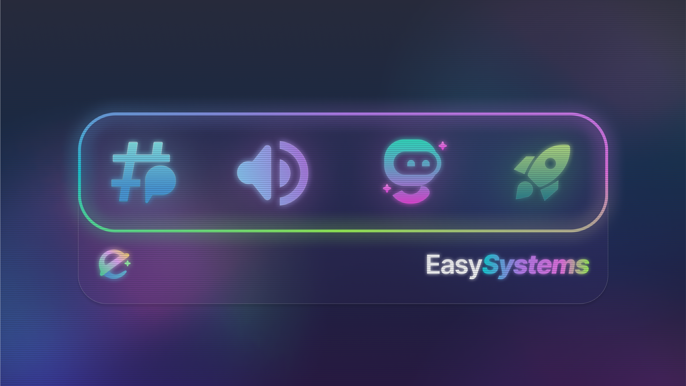

Hey **everyone**,  
It's been a hot minute since you last heard from us here, but that just means we've been hard at work behind the scenes. Time for a quick (and exciting) update!!!

<!-- truncate -->

Over the past few months our team has been super busy developing new internal tools for our staff. These tools may not be visible to you yet, but trust us - some of them will definitely improve your experience in the near future. :O

:::info[Sounds interesting?]
Interested in joining our staff team? You can find out more [here](/blog/11-23-2024-staff-apps)!
:::

But wait, there's more! We've also been cooking up some really cool updates that you'll be seeing in the coming months. Here's a sneak peek at what's coming in 2025!

## 🚀 Roadmap 2025 ##

### 🤖 New EasySystems Bot
YES, you heard right! The EasySystems family is growing and we're introducing a brand new bot!  
We're keeping the exact features a secret (just like Apple is when it comes to why the iPad doesn't have a native calculator app) for now, but one thing we can say is that we've listened to your feedback and combined your most requested features into one **super cool** bot!

And here's the best part **for the first time ever, one of our bots will be 🎉 open source!** 🎉 That means you'll have the chance to contribute, customise and even add your own features. Stay tuned for more details!

### 🌐 EasySystems Web V2
Alongside our new bot, we're also rolling out a **completely redesigned** version of our company website!
The new site will include a redesigned **[custom branding](https://ezsys.link/premium) dashboard**, a f-f-fresh, modern look, and a smoother overall experience. We can't wait for you to check it out! 😉

### 📊 Bot Dashboards
Managing our bots is about to get a whole lot easier! With the release of **EasySystems Web V2**, we're introducing **dedicated bot dashboards**. (There are currently **no plans** to release the first dashboard with EasySystems Web V2).

Each bot will get its own **unique dashboard**, making it super easy to manage features, customise settings and access bot functionality with just a few clicks. No more complicated commands - just a sleek and user-friendly interface!

### 🌍 Internationalization
Great news for our global community! We're bringing back **internationalization** so that more people can enjoy our products in their native language.

Just a few days ago we introduced our staff to a new translation tool called **Weblate** (similar to Crowdin). We're starting with **EasyThreads** and gradually expanding to other products.

And here's the **coolest** part - you can help translate our products into your own language! If you're interested, stay tuned for more details on how to get involved.

---

## ❓ FAQ

  
When will these great features be released?

  

    We don't have exact release dates yet, but rest assured we'll be announcing new features as soon as they're ready!
  

  :::tip
  Want to be among the first to try out new features? Join our [**EasySystems Labs - Discord Server**](https://ezsys.link/labs) to participate in early access testing and beta programs! 🚀
  :::

---

That’s all for now, folks! 2025 is going to be an **exciting** year, and we can’t wait to share all these amazing updates with you. Stay tuned, and as always, thanks for being part of the **EasySystems** community! 💙