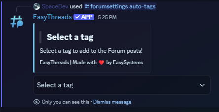

# /forumsettings auto-tags
**Default Permissions:** Administrator
## Description
The **/forumsettings auto-tags** command allows you to automatically apply tags to a forum post in a specific channel if a post is created in that channel. This command is useful for organizing forum posts and making it easier for users to find relevant content. The tags are applied based on the settings you choose in the select menu that appears when you run the command.
## Options
- **channel:** The forum channel where you want to apply tags. *(required)*
## Examples
**Apply tags to a forum post:**
```bash
/forumsettings auto-tags channel:forum
```
This will open a select menu and apply tags to the forum post in the forum "forum".

