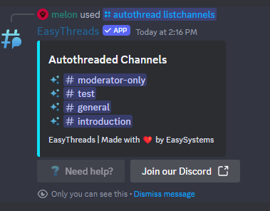

# /autothread listchannels
**Default Permissions:** Administrator
## Description
By using the **/autothread listchannels** command, you can view all the channels that have currently autothreading enabled.

If you desire to **enable autothreading** at a specific channel, one can do so by using the command **[/autothread enable](/docs/easythreads/autothreading/autothread/autothread-enable)**.  
Conversely, if you desire to **disable autothreading** at a specific channel, one can do so by using the command **[/autothread disable](/docs/easythreads/autothreading/autothread/autothread-disable)**.
## Examples
**Server with autothreading channels**
```bash
/autothread listchannels
```
This will list all the channels that have autothreading enabled.



**Server without autothreading channels**
```bash
/autothread listchannels
```
This will return a message that no channels have autothreading enabled.

