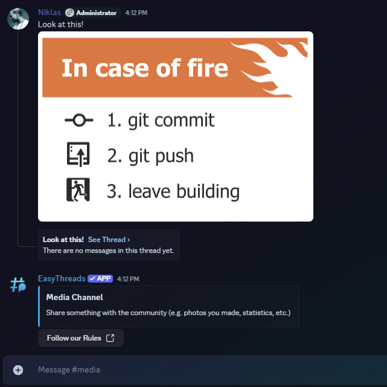

# /stickymessage create

:::info[Premium Limited]
This command is **limited to custom branding**. If you want to use this command, you have to buy the **[Custom Branding](https://ezsys.link/premium)** Version of EasyThreads.
:::

**Default Permissions:** Administrator
## Description
By using the **/stickymessage create** command you can create a sticky message in a specific channel. This will only work if autothreading is enabled in the channel.
## Options
- **channel**: The channel you want to create the sticky message in. *(required)*
- **message**: The message you want to send as a sticky message. *(required)*
- **image**: The image you want to send as a sticky message. *(optional)*
- **embed-title**: The embed you want to send as a sticky message. *(optional)*
- **embed-description**: The embed you want to send as a sticky message. *(optional)*
- **embed-image**  The embed image you want to send as a sticky message. *(optional)*
- **embed-color**: The embed color you want to send as a sticky message. *(optional)*
- **link-button-label** : The label of the link button you want to send as a sticky message. *(optional)*
- **link-button-url**: The URL of the link button you want to send as a sticky message. *(optional)*

## Examples
```bash
/stickymessage create channel:media embed-title:Media Channel embed-description:Share something with the community (e.g. photos you made, statistics, etc.) embed-color:#3657b1 link-button-label:Follow our Rules link-button-url:linktorules
```

This will create a message like this:

