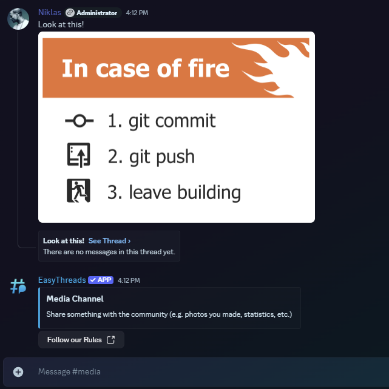

# /stickymessage edit

:::info[Premium Limited]
This command is **limited to custom branding**. If you want to use this command, you have to buy the **[Custom Branding](https://ezsys.link/premium)** Version of EasyThreads.
:::

**Default Permissions:** Administrator

## Description
By using the **/stickymessage edit** command you can edit an existing sticky message in a specific channel. This will only work if autothreading is enabled in the channel and there is already a sticky message set in the channel. This command is useful for updating the content of the sticky message without having to delete and recreate it. You can find information about how to create a sticky message in the **[Create Sticky Message](/docs/easythreads/autothreading/stickymessage/stickymessage-create)** command documentation.

## Options
- **channel**: The channel containing the sticky message you want to edit. *(required)*
- **message**: The new message content for the sticky message. *(optional)*
- **image**: The new image for the sticky message. *(optional)*
- **embed-title**: The new embed title for the sticky message. *(optional)*
- **embed-description** : The new embed description for the sticky message. *(optional)*
- **embed-image**: The new embed image for the sticky message. *(optional)*
- **embed-color**: The new embed color for the sticky message. *(optional)*
- **link-button-label**: The new label for the link button. *(optional)*
- **link-button-url**: The new URL for the link button. *(optional)*

## Variables
- **\{message}**: The first 50 characters of the message trigerring the autothreading
- **\{firstline}**: The first line of the message trigerring the autothreading
- **\{embedtitle}**: The title of the embed in the message trigerring the autothreading
- **\{filename}**: The name of the first provided file. If no file is provided it will be "No File Name
- **\{user}**: The username of the user sending the message
- **\{usernickname}**: The nickname/display Name of the user triggeringthe autothreading
- **\{usermention}**: This will mention the user triggering the autothreading
- **\{guild}**: The name of the server
- **\{newline}**: This will start a new line in messages sent by the app
- **\{time}**: This will be replaced with the current time. Default timezone is UTC, it can be changed guild-specific with the **[/timezone](/docs/easythreads/general/timezone)** command.
- **\{date}**: This will be replaced with the current date. Default timezone is UTC, it can be changed guild-specific with the **[/timezone](/docs/easythreads/general/timezone)** command.

## Examples
```bash
/stickymessage edit channel:media embed-title:Updated Media Channel embed-description:Share your latest creations! embed-color:#3657b1 link-button-label:Read the Rules link-button-url:linktorules
```

This will update the sticky message in the specified channel:

