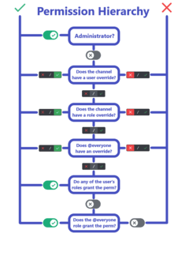

# The Application did not respond

## Issue
The application did not respond to your command. This can happen for a variety of reasons, and it is important to understand the context in which this error occurs. The most common causes will be listed below, along with their solutions. If you are still having issues after trying the solutions, please contact support.

## Missing Permissions
The application requires certain permissions to function properly. If the application does not have the required permissions, it will not be able to respond to your command. Please check the permissions of the application and make sure it has the required permissions. You can temporarily give the application administrator permissions to check if this is the issue. If it works with administrator permissions, please check the permissions of the application and make sure it has the required permissions. You can find more information about the required permissions in the [Permissions](https://ezsys.link/permissions) documentation. If the Bot is not responding to your command, even with administrator permissions, please check the other issues listed below. You can use the permission hierarchy image below to understand the permission hierarchy of Discord.

## Bot is offline
If the Bot is offline, it will not be able to respond to your command. Please check if the Bot is online and try again. If the Bot is offline, please check the status of the Bot in the status channel of the support server. If it is shown as offline, ít is most likely a server issue. The Developers will work on a fix as soon as they are aware of the issue. If the Bot is online, please check the other issues listed below.

## Forum Tag Required
If you are using a command or feature, that creates a forum post, and the forum requires a tag, the Bot will not be able to create the forum post. Please check if the forum requires a tag and if so, disable the tag requirement in the channel settings and try again.

## Still not working?
If you have tried all the solutions listed above and the Bot is still not responding to your command, please contact support. You can do this by joining our [Support Server](https://ezsys.link/support) and creating a ticket. Please provide as much information as possible about the issue you are experiencing, including the command you are trying to use, the channel you are using it in, your server id, and any error messages you are receiving. The support team will be happy to help you resolve the issue.