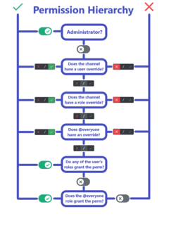

# Autothreading does not work

## Issue
If the bot does not create a thread when you send a message in a channel, it is most likely due to one of the following issues. Please check the list below and try the solutions provided.

## Missing Permissions
The application requires certain permissions to function properly. If the application does not have the required permissions, it will not be able to respond to your command. Please check the permissions of the application and make sure it has the required permissions. You can temporarily give the application administrator permissions to check if this is the issue. If it works with administrator permissions, please check the permissions of the application and make sure it has the required permissions. You can find more information about the required permissions in the [Permissions](https://ezsys.link/permissions) documentation. If the Bot is not responding to your command, even with administrator permissions, please check the other issues listed below. You can use the permission hierarchy image below to understand the permission hierarchy of Discord.

## Autothreading is disabled
If the autothreading is disabled in the channel, the Bot will not be able to create a thread. Please check if the autothreading is enabled in the channel by using the [/autothread listchannels](/docs/easythreads/autothreading/autothread/autothread-listchannels) command. If the channel is not listed, please use the [/autothread enable](/docs/easythreads/autothreading/autothread/autothread-enable) command to enable autothreading in the channel. If the channel is listed, check the other issues listed below.

## Autothreading Settings ignore the message
There are several settings, such as require-attachment or the **/block** command, that could prevent the thread of being created. Please check if you, or a role you have is blocked by using the [/block list](/docs/easythreads/autothreading/block/block-list) command. If you are blocked, you can re-use the block command to unblock yourself or the role. If you are not blocked, please set all the options, that would prevent the thread from being created, to false. You can do this by using the [/autothread edit](/docs/easythreads/autothreading/autothread/autothread-edit) command. If you are still having issues, please check the other issues listed below.

## Bot is offline
If the Bot is offline, it will not be able to respond to your command. Please check if the Bot is online and try again. If the Bot is offline, please check the status of the Bot in the status channel of the support server. If it is shown as offline, ít is most likely a server issue. The Developers will work on a fix as soon as they are aware of the issue. If the Bot is online, please check the other issues listed below.

## Threads of other users are not shown
If you have set the option **private** to true, the threads of other users will not be shown in the channel. Those threads are only visible to the user who created the thread and the moderators of the server. The moderators can see the thread in the threads tab, but not directly under the message such as for public threads. If you want to make the thread public, please use the [/autothread edit](/docs/easythreads/autothreading/autothread/autothread-edit) command and set the option **private** to false. Private Threads are only visible to those, with **Manage Server** or **Administrator** Permissions. If you are still having issues, please check the other issues listed below. If it is set 

## Still not working?
If you have tried all the solutions listed above and the Bot is still not creating threads, please contact support. You can do this by joining our [Support Server](https://ezsys.link/support) and creating a ticket. Please provide as much information as possible about the issue you are experiencing, including the command you are trying to use, the channel you are using it in, your server id, and any error messages you are receiving. The support team will be happy to help you resolve the issue.