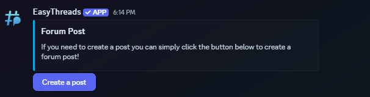

# /panel forums
**Default Permissions:** Administrator
## Description
The **/panel forums** command allows you to create a panel with a button that creates a forum post when clicked. This is useful for creating a forum post with a specific name and message. The command also allows you to customize the embed and button appearance, as well as set the post message and pin it if desired. 

## Options
- **forum**: The forum channel where the button will be placed. *(required)*
- **content**: The content of the button. *(required)*
- **embed-title**: The title of the embed. *(optional)*
- **embed-description**: The description of the embed. *(optional)*
- **embed-footer**: The footer of the embed. *(optional)*
- **embed-image**: The image of the embed. *(optional)*
- **embed-color**: The color of the embed. *(optional)*
- **button-text**: The text of the button. *(optional)*
- **button-color**: The color of the button. *(optional)*
- **button-emoji**: The emoji of the button. *(optional)*
- **post-name**: The name of the post. *(optional)*
- **custom-postname**: Allow the user to set the name used to create the post with. This will disable the post-name option *(optional)*
- **post-message**: The message that will be sent in the post. *(optional)*
- **custom-postmessage**: Allow the user to set the message used to create the post with. This will disable the post-message option *(optional)*
- **post-chatcooldown**: The cooldown time to send messages in the post. *(optional)*
- **post-creation-cooldown**: The cooldown time to create a post using the panel (per-user) *(optional)*
- **archive-time**: The time of inactivity after which the post will be archived. *(optional)*


## Variables
- **\{user}**: The username of the user creating the post
- **\{usernickname}**: The nickname/display name of the user creating the post
- **\{usermention}**: This will mention the user creating the post
- **\{guild}**: The name of the server
- **\{newline}**: This will start a new line in messages sent by the app
- **\{time}**: This will be replaced with the current time. Default timezone is UTC, it can be changed guild-specific with the **[/timezone](/docs/easythreads/general/timezone)** command.
- **\{date}**: This will be replaced with the current date. Default timezone is UTC, it can be changed guild-specific with the **[/timezone](/docs/easythreads/general/timezone)** command.

## Example
```bash
/panel forums forum:forum post-name:{user}'s post' embed-title:Forum Post embed-description:If you need to create a post you can simply click the button below to create a forum post! embed-color:Light Blue
```
This will create a panel, that looks like this:

