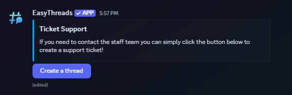
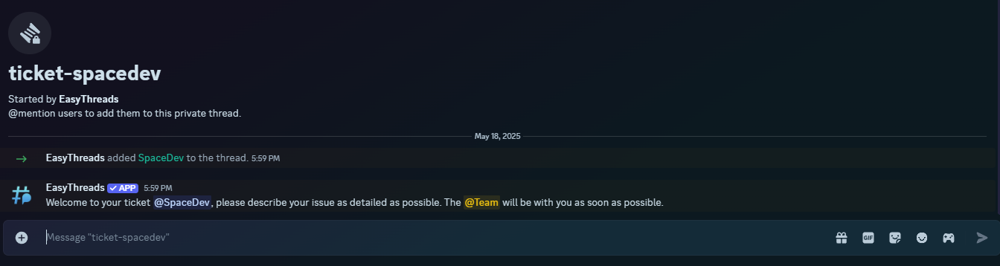

# /panel threads
**Default Permissions:** Administrator
## Description
The **/panel threads** command allows you to create a panel with a button that creates a thread in a specific channel. This is useful for creating a ticket system or any other system where you want users to be able to create threads easily.

## Options
- **channel**: The channel where the button will be placed. *(required)*
- **content**: The content of the button. *(required)*
- **embed-title**: The title of the embed. *(optional)*
- **embed-description**: The description of the embed. *(optional)*
- **embed-footer**: The footer of the embed. *(optional)*
- **embed-image**: The image of the embed. *(optional)*
- **embed-color**: The color of the embed. *(optional)*
- **button-text**: The text of the button. *(optional)*
- **button-color**: The color of the button. *(optional)*
- **button-emoji**: The emoji of the button. *(optional)*
- **thread-name**: The name of the thread. *(optional)*
- **custom-threadname**: Allow the user to set the name used to create the thread with. This will disable the thread-name option *(optional)*
- **thread-message**: The message that will be sent in the thread. *(optional)*
- **pin-threadmessage**: Pin the thread message. *(optional)*
- **custom-threadmessage**: Allow the user to set the message used to create the thread with. This will disable the thread-message and pin-threadmessage option *(optional)*
- **pin-custommessage**: Pin the custom message. *(optional)*
- **private-thread**:Whether the thread should be private or not. *(optional)*
- **block-invites**: If private-thread option and this option are set to true, the thread will be private and no one except moderators can add users to the thread by mentioning them. *(optional)*
- **archive-time**: The time of inactivity after which the thread will be archived. *(optional)*

## Variables
- **\{user}**: The username of the user creating the thread
- **\{usernickname}**: The nickname/display name of the user creating the thread
- **\{usermention}**: This will mention the user creating the thread
- **\{guild}**: The name of the server
- **\{newline}**: This will start a new line in messages sent by the app
- **\{time}**: This will be replaced with the current time. Default timezone is UTC, it can be changed guild-specific with the **[/timezone](/docs/easythreads/general/timezone)** command.
- **\{date}**: This will be replaced with the current date. Default timezone is UTC, it can be changed guild-specific with the **[/timezone](/docs/easythreads/general/timezone)** command.

## Example
```bash
/panel threads channel:#text-ezt thread-name:ticket-{user} embed-title:Ticket Support embed-description:If you need to contact the staff team you can simply click the button below to create a support ticket! embed-color:Light Blue private-thread:True thread-message:Welcome to your ticket {usermention}, please describe your issue as detailed as possible. The @Team will be with you as soon as possible.
```
This will create a panel, that looks like this:



And when the button is clicked, it will create a thread with the name "ticket-\{user\}" and send the message "Welcome to your ticket \{usermention\}, please describe your issue as detailed as possible. The @Team will be with you as soon as possible." in the thread.
