# Contributing to EasySystems
We welcome contributions from the community!!! 

To get started:
**[Read our Contributing Guide](https://github.com/Easy-Systems/documentations/blob/main/CONTRIBUTING.md)**

## How to contribute
In this guide we give you a step-to-step guide how you can contribute to EasySystems.
### Basics
#### Step 1: Choose a project
First of all you have to choose a project you want to contribute to. You can find all our projects on our **[GitHub Organization](https://github.com/Easy-Systems)**.

If you want to contribute to our documentations, you can find them in the **[documentations repository](https://github.com/Easy-Systems/documentations)**.
#### Step 2: Sign the CLA
Before you can contribute to our projects, you have to sign our Contributor License Agreement (CLA).  
You can **[sign the CLA here](https://ezsys.link/cla)**.
:::caution
If you don't sign the CLA, we can't accept your contributions.
:::
### Contribute to the documentation
#### Pre-Requisites:
- [x] **[Github Account](https://github.com/)**
- [x] **[CLA](https://ezsys.link/cla)** signed
- [x] **[Markdown](https://www.markdownguide.org/cheat-sheet/)** Basic understanding  

#### Optional:
- [x] **[Git](https://git-scm.com/)** installed
- [x] **[Node.js](https://nodejs.org/en/)** installed

#### Step 1: Fork the repository
First of all you have to fork the repository you want to contribute to. You can do this by clicking on the **Fork** button in the top right corner of the repository page.
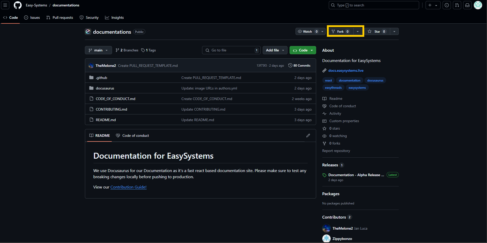
##### Step 1.1: Setup the fork
You can give the fork your own name & description or you can just fork it with the names we use too. Once decided: press on the **Create Fork** button.  
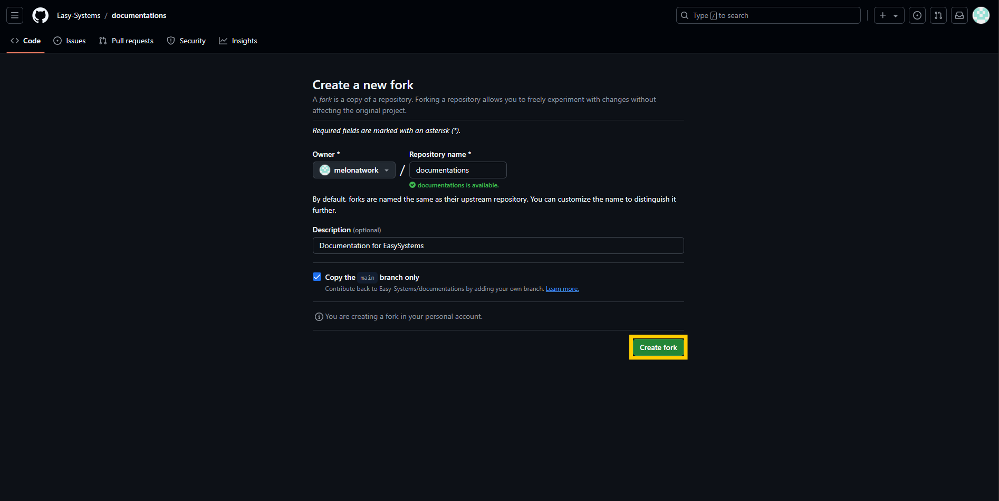

Now it takes a few seconds and your fork is created!!

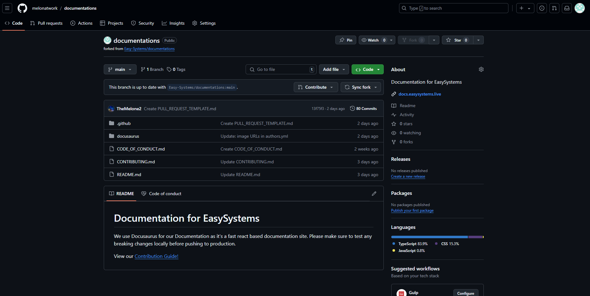
##### Step 1.2 (optional): Clone the repository
If you want to work on your local machine, you can clone the repository. You can do this by clicking on the **Code** button and **download the source code as ZIP**. 

Alternately, you can simply replace the github.com with github.**dev** to open an online [Github Codespace](https://docs.github.com/codespaces).  

You are free to decide whether you want to use the methods in this guide or use your own.

#### Step 2: Make your changes
Now you can make your changes. You can do this directly on the GitHub website or you can clone the repository and work on your local machine.  
In this guide we changed the **README.md** file and added the link to this tutorial!
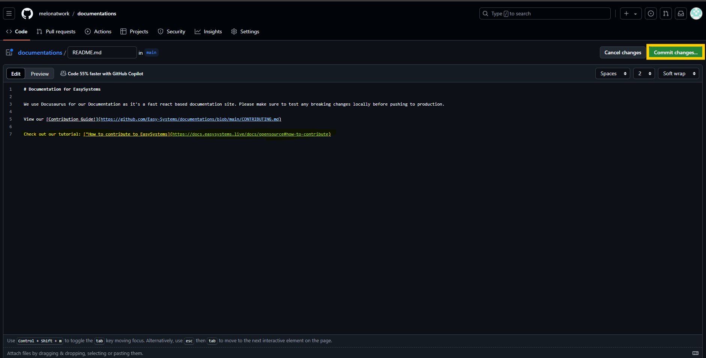
##### Step 2.1: Commit your changes
If you made your changes, you have to commit them. You can do this by clicking on the **Commit changes** button.  
To make life easier for you and us, please use proper commit names and descriptions! **[You can find the format here](https://github.com/Easy-Systems/documentations/blob/main/CONTRIBUTING.md#semantic-commit-messages)**.
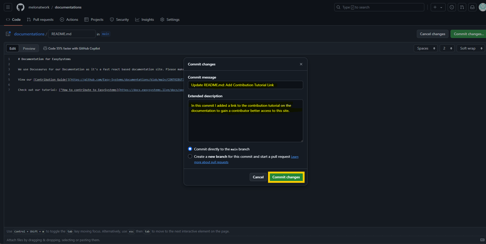
##### Step 2.2: Create a Pull Request
After you committed your changes, you can create a Pull Request (PR).  
Your fork repository should now have a message saying "This branch is x commits ahead of Easy-Systems/documentations:main".  

Click the **contribute** button next to it.
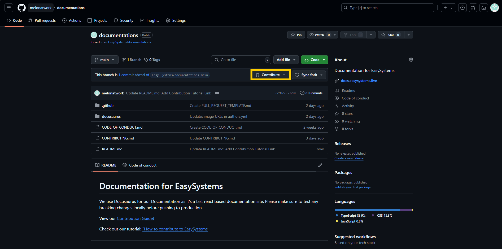

Now you can create a Pull Request. Click on "**Open pull request**".

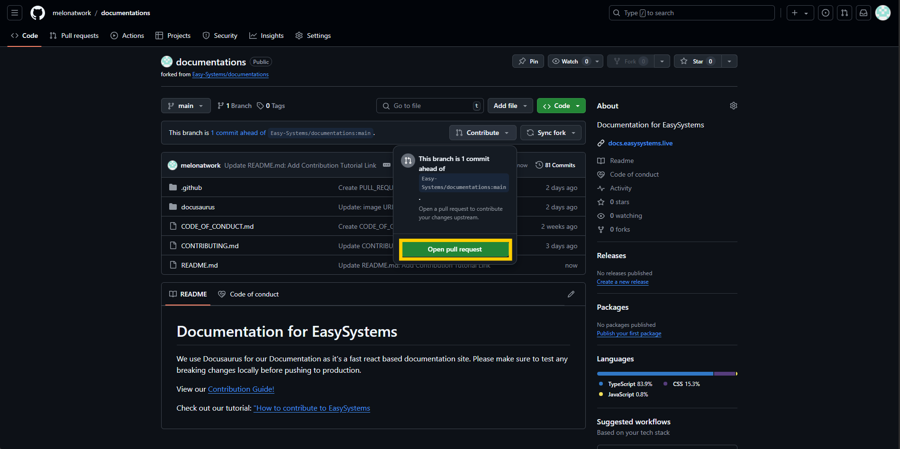

Now you can give your PR a title and description. Make sure to tick all task on the predefined check list before creating your PR.

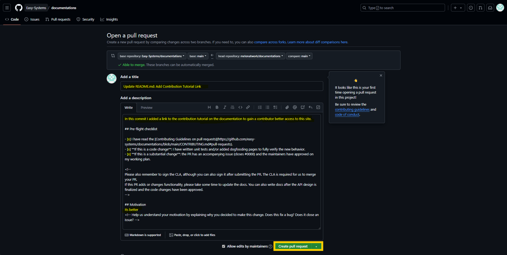

After you created your PR, you can see the status of your PR. If you see a green checkmark, your PR is good to go. If you see a red cross, you have to fix the issues before we can merge your PR.

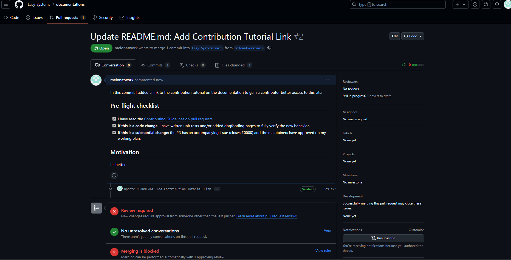
#### Step 3: Wait for the review
Now you have to wait for the review. We will review your PR as soon as possible. If we have any questions or suggestions, we will comment on your PR. In our case everything looks good, so our maintainer can easily accept it.

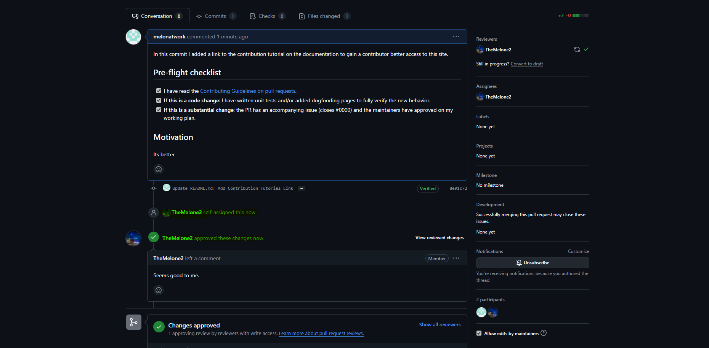

If everything looks good and we decide that your PR is ready for the live site, we will merge it into our code base and your content will be live with the next update.

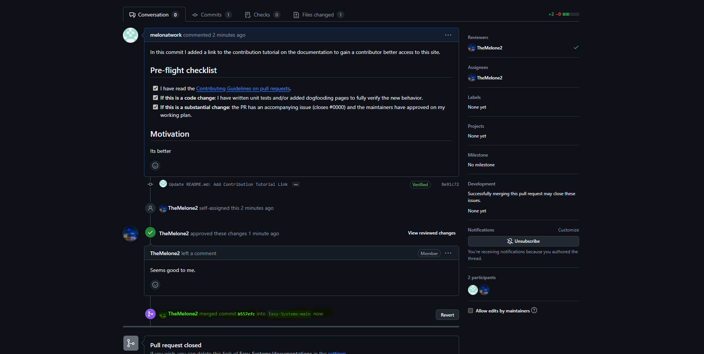

#### Congratulations, you successfully contributed to our documentations!! 🎉🎉🎉

:::info
If you have any questions or need help, feel free to ask in our beta/alpha testing **[Discord](https://ezsys.link/labs)**.
:::
