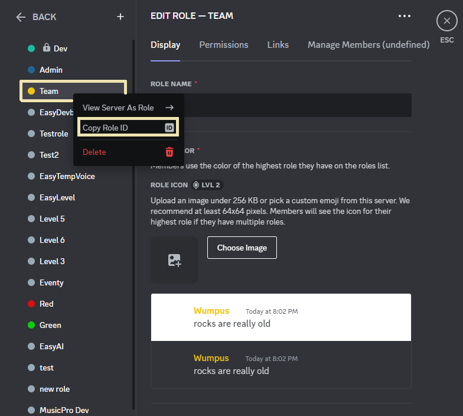
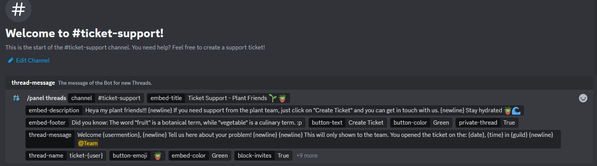
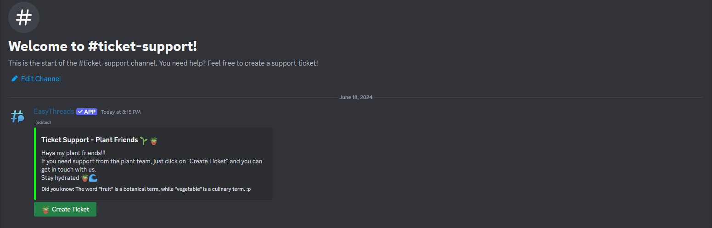
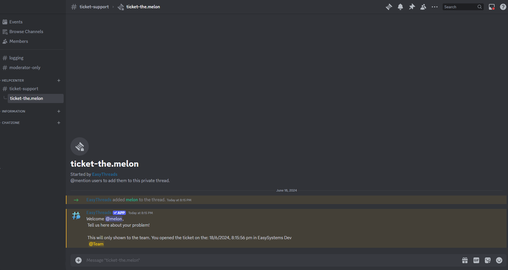

# Setting up a ticket system

In this tutorial we will show you how to set up a ticket system with EasyThreads.
## Prerequisites
- You need to have the [EasyThreads](https://easythreads.xyz/invite) or [EasyThreads Premium / Custom Branding](https://easythreads.xyz/premium) in your server with the proper permissions.
- You have the `administrator` - permission in your server
## Step 1: Create a channel for the ticket system
Create a new channel where the tickets will be created. In our example the channel is named: `ticket-support`.
## Step 2: Create the ticket panel
We are using **[/panel threads](/docs/panels/panel)** to create this ticket panel.
##### Panel Channel:
First you'll set the channel you've just created to the channel the panel will be send in.  
Your command should look like this now:
```/panel threads channel:#ticket-support```  

##### Panel Title:
Next, you'll set the title of the panel with the `embed-title` - param. In our example, we'll use 
> Ticket Support - Plant Friends 🪴🌱 

##### Panel Description:
Now you can set the description of the panel with the `embed-description` - param. Since we are running in this example a plant server, the description is server-topic related. For our plant server it will be this description:
> "Heya my plant friends!!!
If you need support from the plant team, just click on "Create Ticket" and you can get in touch with us.
Stay hydrated 🪴🌊"

##### Panel Footer:
You can set a footer for the panel by using the `embed-footer` - param. We are using a fun fact about fruits and vegetables:
> Did you know: The word "fruit" is a botanical term, while "vegetable" is a culinary term. 🌱

##### Panel Button:
But how can an user created the ticket?! Exactly! With a button and with the `button-text` - param you can set the text of the button. In our example it will be:
> Create Ticket  

Now you can set the `button-emoji` - param to add an emoji to the button. We use the plant emoji: 🌱

After this is done, you can set the `button-style` - param to set the style of the button. Since plants are most likely green, we use green.

##### Panel Private Thread:
In order to prevent other server members from viewing user-specific problems, we set the "private-thread" parameter to "True".

##### Panel Thread Message:
You can set a message that will be sent to the user when they open a ticket. This message can be customized with the `thread-message` - param. We dediced to set it in our example to:  
> Welcome \{usermention}, \{newline}   
Tell us here about your problem! \{newline} \{newline}  
> 
> This will only shown to the team.
You opened the ticket on the: \{date}, \{time} in \{guild} 
> \{newline}  \<@&roleid\>
###### Getting your team into the ticket:
Since we've set `private-thread` to "true", only EasyThreads and the user who created the ticket is in the thread. We can change that by **pinging a specific role**.  
In our case we ping the team role and our role id is: `1173692530081144842`

One way to get a specific role id is by going into your server settings > roles and click on the three dots next to the role name or right clicking on the specific role and click on "Copy Role ID"

  
You can include your id by replacing "roleid" in `<@&roleid>` with your role id.

##### Panel Thread Name:
You can set the name of the thread with the `thread-name` - param. We are using the following name for the thread:
> ticket-\{user}  

This will create a thread with the username of the user who created the ticket.

##### Panel Embed Color:
You can set the color of the embed with the `embed-color` - param. We are using the color green for our plant server.

##### Panel Block Invites:
You can set the `block-invites` - param to "True". When this is enabled only moderators and the thread creator (EasyThreads) can add new members to the thread.

##### Final Command:
After you've set all the parameters, your command could look like this:
```
/panel threads channel:#ticket-support embed-title:Ticket Support - Plant Friends :seedling: :potted_plant: embed-description:Heya my plant friends!!! {newline} If you need support from the plant team, just click on "Create Ticket" and you can get in touch with us. {newline} Stay hydrated :potted_plant::ocean: embed-footer:Did you know: The word "fruit" is a botanical term, while "vegetable" is a culinary term. :p button-text:Create Ticket button-color:Green private-thread:True thread-message:Welcome {usermention}, {newline} Tell us here about your problem! {newline} {newline} This will only shown to the team. You opened the ticket on the: {date}, {time} in {guild} {newline}  <@&roleid> thread-name:ticket-{user} button-emoji::potted_plant: embed-color:Green block-invites:True
```


Now you have to just hit "enter" to send the command!

And EasyThreads will a ticket panel, in our case it looks like this:


## Step 3: Test the ticket system
After you've set up the ticket panel, you can test it by clicking on the button and creating a ticket.
You should see a new thread created with the name "ticket-\<username\>" and the message you
set in the `thread-message` - param.
You can also test the private thread by trying to view the thread as a non-moderator.
If everything is set up correctly, you should not be able to view the thread as a non-moderator.

For us it looks like this if an user creates a ticket:


**🎉 Congratulations! You've successfully set up a ticket system with EasyThreads. (*^_^*)**

## Frequently Asked Questions
#### Q: What are `{newline}`,... in the final command?  
**A:** `{newline}`, `{date}`, `{time}`, `{guild}` and `{user}` are **[variables](/docs/general/help#variables)** which you can use within EasyThreads.

#### Q: Can I use emojis in the panel?
**A:** You can! We recommend to use Discord Built-In Emojis, like:  
"seedling" -> 🪴 or  "potted_plant" -> 🌱 